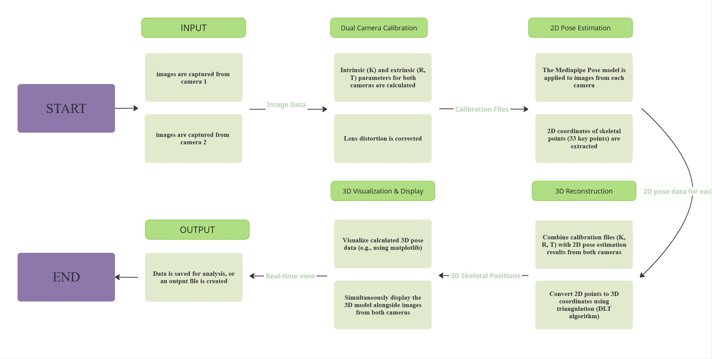
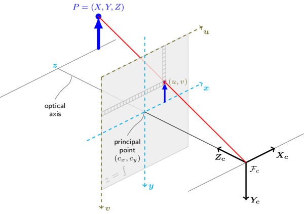
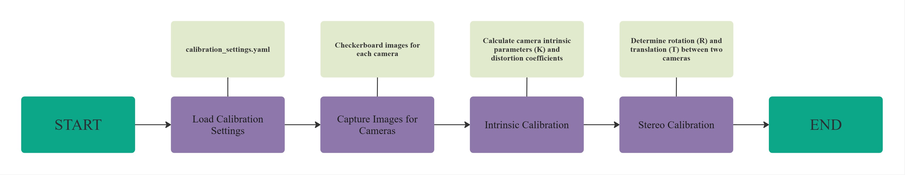
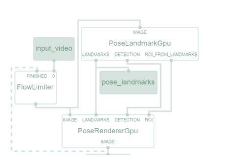
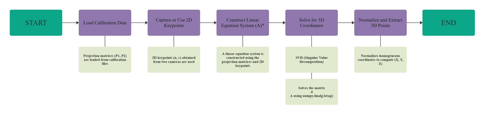
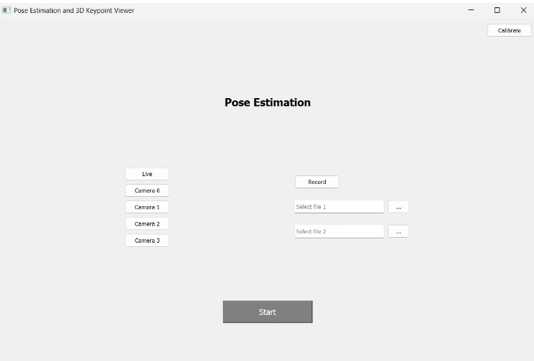
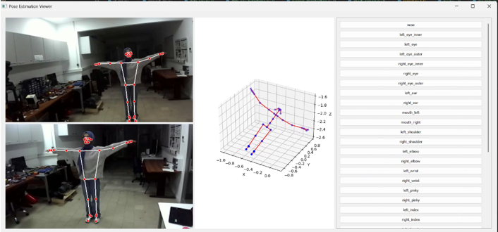
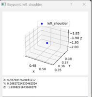

# Sensor Project – 3D Human Pose Tracking from Stereo Cameras

This repository implements a complete pipeline for capturing synchronized video from two cameras, detecting 2D human pose keypoints, calibrating the stereo rig, reconstructing 3D joint positions via Direct Linear Transformation (DLT), and visualizing the results in a user-friendly PyQt5 GUI.

---

## 📌 Problem & Proposed Solution

**Problem:** Accurate 3D human pose estimation typically requires expensive motion-capture systems or depth sensors.

**Solution:**  
- Use two inexpensive RGB cameras.  
- Calibrate intrinsic & extrinsic parameters.  
- Detect 2D landmarks with MediaPipe Pose.  
- Triangulate to 3D using DLT.  
- Display live 2D/3D poses in a PyQt5 interface.

---

## 🧭 Objectives

1. **Stereo Capture** of synchronized frames from Camera 1 and Camera 2.  
2. **Calibration** of intrinsic (K) & extrinsic (R, T) parameters, including distortion correction.  
3. **2D Landmark Extraction** with MediaPipe Pose (33 keypoints).  
4. **3D Reconstruction** via DLT triangulation.  
5. **Real-time GUI** for 2D overlay and 3D scatter/skeleton visualization.  

---

## 📋 Requirements

- Python 3.8+  
- OpenCV  
- NumPy, SciPy  
- PyYAML  
- MediaPipe  
- PyQt5  
- Matplotlib  

---

## 🔧 Method Overview



1. **Input**: Frames from Camera 1 & 2  
2. **Dual Camera Calibration**  
   - Compute intrinsic K and extrinsic (R, T) for both cameras  
   - Correct radial & tangential distortion  
3. **2D Pose Estimation**  
   - Run MediaPipe Pose on each view → (u, v) keypoints  
4. **3D Reconstruction**  
   - Combine 2D keypoints with calibration → DLT triangulation → (X, Y, Z)  
5. **Visualization**  
   - Display 2D overlays & 3D scatter/skeleton in GUI  
6. **Output**: Live view & saved JSON of 3D poses  

---

## 📐 Camera Model & Calibration



- **Intrinsic Matrix (K):** \(f_x, f_y, c_x, c_y\)  
- **Distortion:** Radial & tangential coefficients  
- **Extrinsic (R, T):** Rotation and translation between camera frames  



1. Load `calibration_settings.yaml`  
2. Capture checkerboard images from each camera  
3. Intrinsic calibration → K, distortion  
4. Stereo calibration → R, T  

---

## 🕴 2D Pose Detection



- **MediaPipe Pose**  
  - `PoseLandmarkGpu` extracts 33 landmarks  
  - `PoseRendererGpu` draws skeleton overlay  
- Outputs synchronized 2D keypoints for each frame  

---

## 🔢 DLT Triangulation



1. Load projection matrices \(P_1, P_2\).  
2. Gather matching 2D points \((u_1, v_1), (u_2, v_2)\).  
3. Build linear system \(A \mathbf{X}=0\).  
4. Solve via SVD → homogeneous \(\mathbf{X}=(X,Y,Z,W)\).  
5. Normalize → 3D coordinates \((X/W, Y/W, Z/W)\).

---

## 💻 Graphical User Interface

### Launch Screen  


- **Live** vs **Record** mode  
- Select camera ports or video files  
- “Start” enabled after selection

### Main Viewer  


- Left: two video feeds with 2D skeleton overlays  
- Center: Matplotlib 3D plot of reconstructed pose  
- Right: Scrollable list of joint buttons  

### Joint Detail Dialog  


- Click a joint button → 3D scatter & exact \((X,Y,Z)\) values

---

## 📁 Repository Structure

```
sensor-project/
│
├── calibration/             # Calibration & DLT scripts
├── pose_estimation/         # 2D pose & 3D conversion
├── gui/                     # PyQt5 application
├── utils/                   # Helper scripts (e.g. camera check)
├── data/                    # Calibration & pose JSON outputs
├── docs/                    # Pipeline diagrams & screenshots
├── calibration_settings.yaml
├── README.md                
└── requirements.txt         # Python dependencies
```

---

## 🚀 Getting Started

1. **Clone & install**  
   ```bash
   git clone https://github.com/ranagursoy/sensor-project.git
   cd sensor-project
   pip install -r requirements.txt
   ```
2. **Calibrate cameras**  
   ```bash
   python calibration/calibration.py calibration_settings.yaml
   ```
3. **Run 2D pose detection**  
   ```bash
   python pose_estimation/pose-model-2d.py
   ```
4. **Convert to 3D**  
   ```bash
   python pose_estimation/convert-3d.py
   ```
5. **Launch GUI**  
   ```bash
   python gui/gui.py
   ```

---
## 📚 References

1. Zhang, Z. “A Flexible New Technique for Camera Calibration.” *IEEE PAMI*, 2000.  
2. Hartley, R., Zisserman, A. *Multiple View Geometry in Computer Vision*, 2003.  
3. Lugaresi, C. et al. “MediaPipe: A Framework for Building Perception Pipelines,” 2019.  
4. Wei, S.-E. et al. “Convolutional Pose Machines,” CVPR 2016.  
5. Furukawa, Y. et al. “Multi-View Stereo: A Tutorial,” 2015.  
6. Cao, Z. et al. “Realtime Multi-Person 2D Pose Estimation Using Part Affinity Fields,” CVPR 2017.  
7. Neverova, N. et al. “DensePose: Dense Human Pose Estimation in the Wild,” CVPR 2018.  
8. Kendall, A. et al. “PoseNet: A Convolutional Network for Real-Time 6-DOF Camera Relocalization,” ICCV 2015.  
9. Triggs, B. et al. “Bundle Adjustment—A Modern Synthesis,” Vision Algorithms 1999.  
